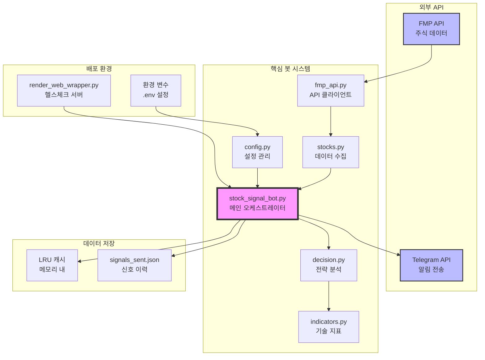
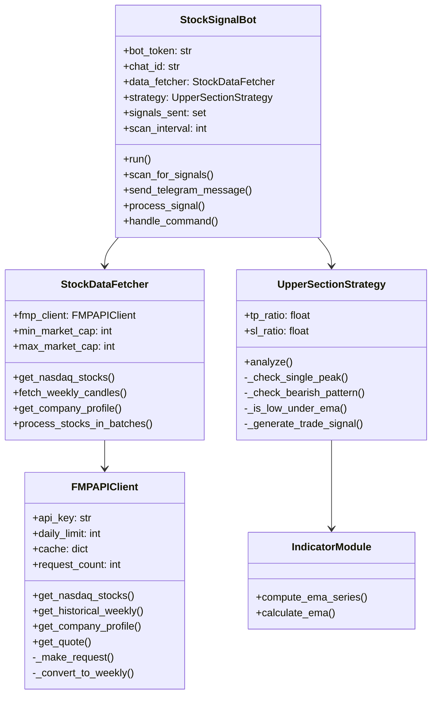
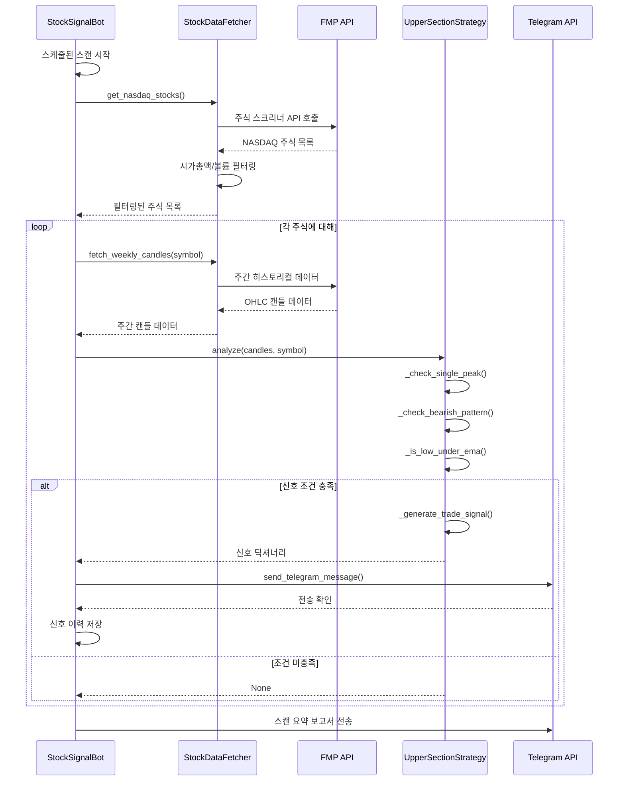
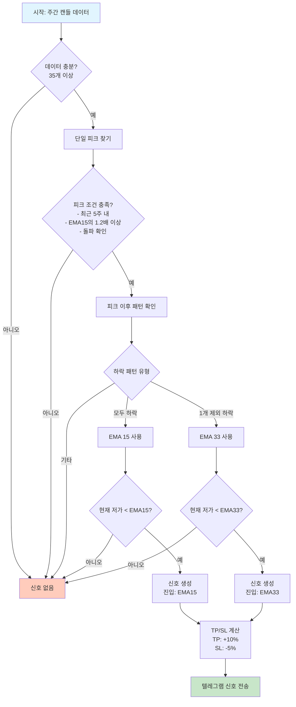
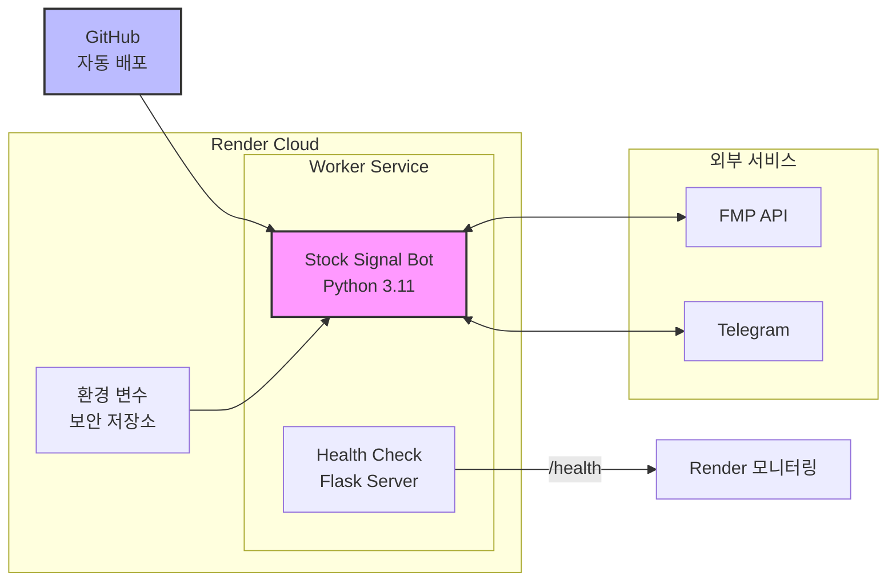
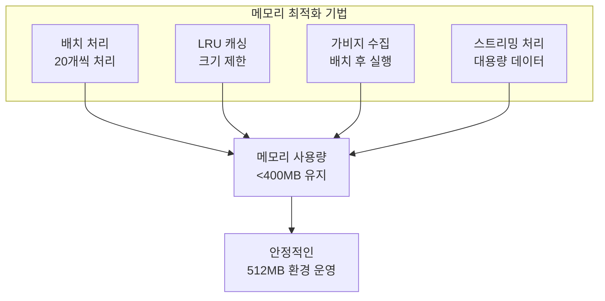
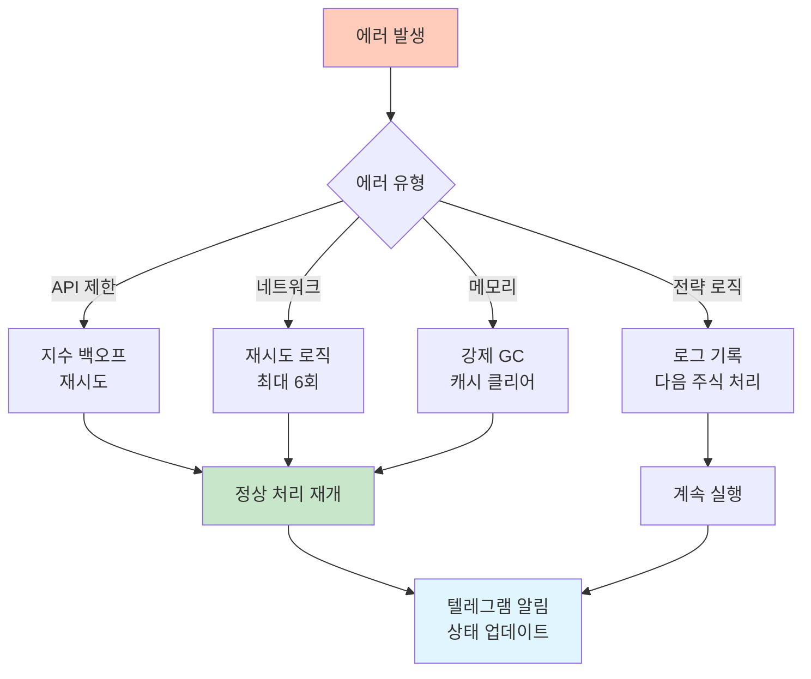

# 아키텍처 문서

## 시스템 개요

NASDAQ 주식 시그널 봇은 Kwon Strategy(Upper Section Strategy)를 사용하여 주식 시장을 모니터링하고 매수 신호를 실시간으로 감지하는 자동화된 거래 신호 시스템입니다. 이 시스템은 주간 캔들스틱 데이터를 분석하여 특정 패턴을 식별하고, 텔레그램을 통해 트레이더에게 즉시 알림을 전송합니다.

### 주요 특징
- **자동화된 시장 스캐닝**: 24/7 NASDAQ 주식 모니터링
- **시가총액 필터링**: 5억~500억 달러 범위의 주식 선별
- **Upper Section 전략**: 단일 피크 + 하락 패턴 + EMA 진입점 식별
- **실시간 알림**: 텔레그램 봇을 통한 즉각적인 신호 전송
- **메모리 최적화**: Render 스타터 플랜(512MB RAM)에 최적화
- **API 관리**: FMP API 요청 제한 관리 및 스마트 캐싱

## 시스템 아키텍처

### 전체 아키텍처 다이어그램



### 컴포넌트 관계도



## 데이터 플로우

### 신호 생성 프로세스



### Upper Section 전략 플로우



## 핵심 컴포넌트 상세

### 1. StockSignalBot (stock_signal_bot.py)
**주요 책임:**
- 전체 시스템 오케스트레이션
- 스캔 스케줄링 및 실행
- 텔레그램 명령어 처리
- 신호 이력 관리
- 에러 처리 및 복구

**주요 기능:**
- `scan_for_signals()`: 주식 스캔 및 신호 감지
- `send_telegram_message()`: 알림 전송
- `handle_command()`: 사용자 명령 처리
- `process_stocks_in_batches()`: 배치 처리로 메모리 최적화

### 2. StockDataFetcher (stocks.py)
**주요 책임:**
- FMP API와의 통신 관리
- 주식 데이터 수집 및 필터링
- 배치 처리 최적화
- 캐싱 전략 구현

**주요 기능:**
- `get_nasdaq_stocks()`: NASDAQ 주식 목록 조회
- `fetch_weekly_candles()`: 주간 캔들 데이터 수집
- `_validate_stock()`: 주식 유효성 검증
- `process_stocks_in_batches()`: 메모리 효율적 배치 처리

### 3. UpperSectionStrategy (decision.py)
**주요 책임:**
- Kwon Strategy 구현
- 패턴 인식 및 분석
- 거래 신호 생성
- 리스크 관리 계산

**전략 단계:**
1. **단일 피크 확인**: 최근 5주 내 단일 최고점
2. **하락 패턴 분석**: 피크 이후 7개 캔들의 패턴
3. **EMA 위치 확인**: 현재 저가가 EMA 아래인지 확인
4. **신호 생성**: 진입가, TP, SL 계산

### 4. FMPAPIClient (fmp_api.py)
**주요 책임:**
- FMP API 요청 관리
- 지수 백오프를 통한 재시도 로직
- LRU 캐싱 구현
- 요청 제한 추적

**주요 기능:**
- `_make_request()`: API 요청 핵심 로직
- `_convert_to_weekly()`: 일간 데이터를 주간으로 변환
- `get_remaining_requests()`: API 할당량 추적

## 외부 통합

### FMP (Financial Modeling Prep) API
```
용도: 주식 시장 데이터 제공
엔드포인트:
- /v3/stock-screener: 주식 스크리닝
- /v3/historical-price-full: 과거 가격 데이터
- /v3/profile: 기업 프로필
- /v3/quote: 실시간 시세
- /v3/is-the-market-open: 시장 상태

요청 제한:
- 무료: 250 요청/일
- 스타터: 750 요청/일
```

### Telegram Bot API
```
용도: 실시간 알림 전송
기능:
- 신호 알림 전송
- 명령어 처리 (/start, /help, /status, /scan 등)
- 스캔 보고서 전송
- 양방향 통신 지원
```

## 배포 아키텍처

### Render 플랫폼 배포



### 배포 사양
- **플랫폼**: Render.com
- **서비스 타입**: Worker (백그라운드 작업)
- **플랜**: Starter ($7/월)
- **메모리**: 512MB RAM
- **리전**: Oregon (US West)
- **런타임**: Python 3.11
- **자동 배포**: GitHub 푸시 시 자동 배포

## 성능 최적화

### 메모리 관리 전략



### API 요청 최적화

1. **스마트 캐싱**
   - 회사 프로필: 2시간 캐시
   - 주간 데이터: 1시간 캐시
   - 실시간 시세: 1분 캐시

2. **지수 백오프**
   - 초기 지연: 1초
   - 최대 재시도: 6회
   - 백오프 배수: 2x (1s → 2s → 4s → 8s → 16s → 32s)

3. **배치 처리**
   - 배치 크기: 20 주식
   - 병렬 처리: 없음 (메모리 절약)
   - 배치 간 가비지 수집

## 설정 관리

### 환경 변수 구조

```yaml
# 필수 API 키
FMP_API_KEY: FMP API 접근 키
TELEGRAM_BOT_TOKEN: 텔레그램 봇 토큰
TELEGRAM_CHAT_ID: 알림 받을 채팅 ID

# 전략 파라미터
TP_RATIO: 0.10  # 이익 실현 비율 (10%)
SL_RATIO: 0.05  # 손절 비율 (5%)

# 필터링 파라미터
MIN_MARKET_CAP: 500000000    # 최소 시가총액 (5억 달러)
MAX_MARKET_CAP: 50000000000  # 최대 시가총액 (500억 달러)
MIN_VOLUME: 100000           # 최소 거래량
MIN_PRICE: 1.0               # 최소 주가
MAX_PRICE: 10000.0          # 최대 주가

# 운영 파라미터
SCAN_INTERVAL: 14400        # 스캔 주기 (4시간)
BATCH_SIZE: 20              # 배치 크기
FMP_DAILY_LIMIT: 99999      # API 일일 제한
LOG_LEVEL: INFO             # 로그 레벨
```

## 모니터링 및 헬스체크

### 헬스체크 엔드포인트

```mermaid
graph TD
    subgraph "Flask 웹 서버 엔드포인트"
        ROOT[/ - 서비스 정보]
        HEALTH[/health - 헬스체크]
        STATUS[/status - 상세 상태]
        METRICS[/metrics - Prometheus 메트릭]
        SCAN[/trigger-scan - 수동 스캔]
        CACHE_CLEAR[/clear-cache - 캐시 클리어]
    end
    
    HEALTH --> RENDER[Render 모니터링]
    STATUS --> ADMIN[관리자 대시보드]
    METRICS --> PROM[Prometheus/Grafana]
    
    style HEALTH fill:#c8e6c9
    style METRICS fill:#fff9c4
```

### 주요 메트릭
- **bot_running**: 봇 실행 상태
- **total_scans**: 총 스캔 횟수
- **total_signals**: 총 신호 수
- **api_requests_remaining**: 남은 API 요청
- **memory_usage_bytes**: 메모리 사용량

## 에러 처리 및 복구

### 에러 처리 계층



### 복구 전략
1. **자동 재시작**: Render가 크래시 시 자동 재시작
2. **신호 이력 보존**: JSON 파일로 영구 저장
3. **부분 실패 허용**: 개별 주식 실패 시 전체 스캔 계속
4. **상태 보고**: 에러 발생 시 텔레그램 알림

## 보안 고려사항

1. **API 키 관리**
   - 환경 변수로 분리
   - Render 보안 저장소 사용
   - 코드에 하드코딩 금지

2. **접근 제어**
   - 텔레그램 채팅 ID 검증
   - 관리자 토큰으로 API 보호
   - 명령어 권한 검증

3. **데이터 보호**
   - HTTPS 통신만 사용
   - 민감 정보 로깅 금지
   - 캐시 데이터 암호화 없음 (비민감 데이터)

## 향후 개선 방향

1. **확장성 개선**
   - Redis 캐시 도입
   - 다중 워커 지원
   - 메시지 큐 구현

2. **전략 확장**
   - 추가 기술 지표 통합
   - 다중 시간대 분석
   - 머신러닝 모델 통합

3. **모니터링 강화**
   - 실시간 대시보드 구축
   - 성과 추적 시스템
   - 자동 백테스팅

4. **사용자 경험**
   - 웹 인터페이스 추가
   - 개인화된 알림 설정
   - 포트폴리오 추적 기능