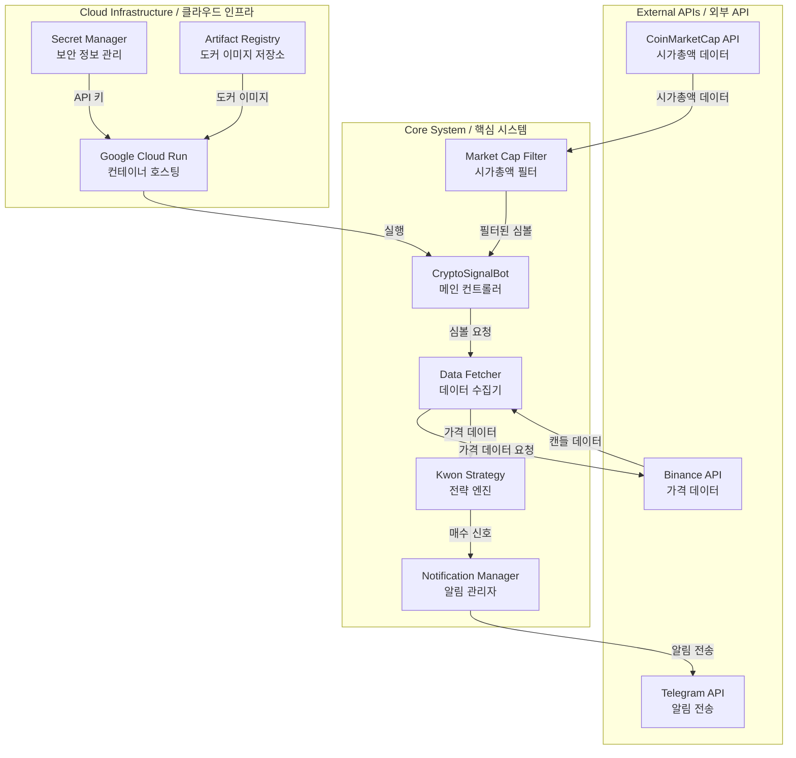
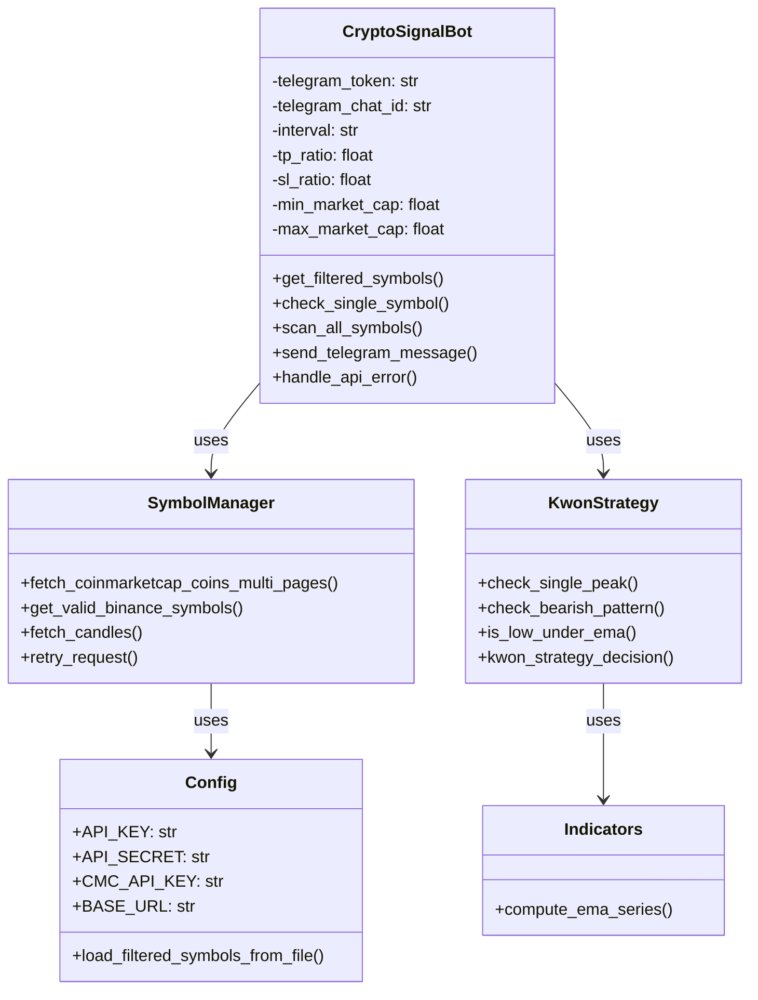
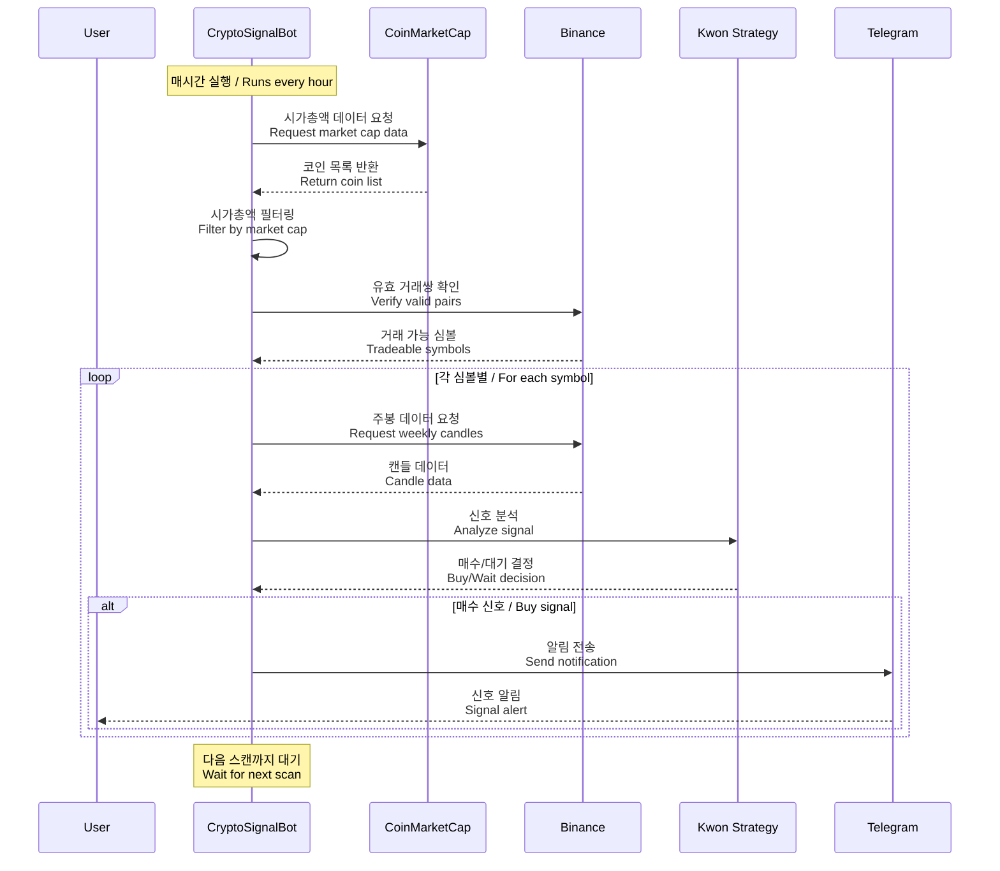
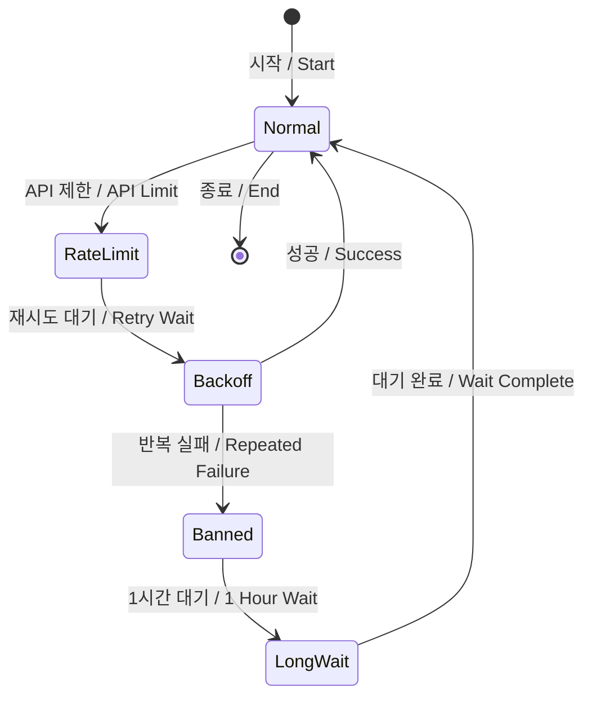
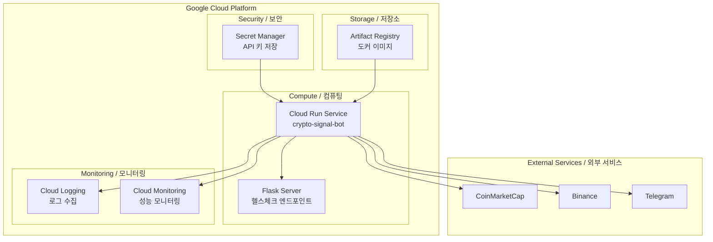
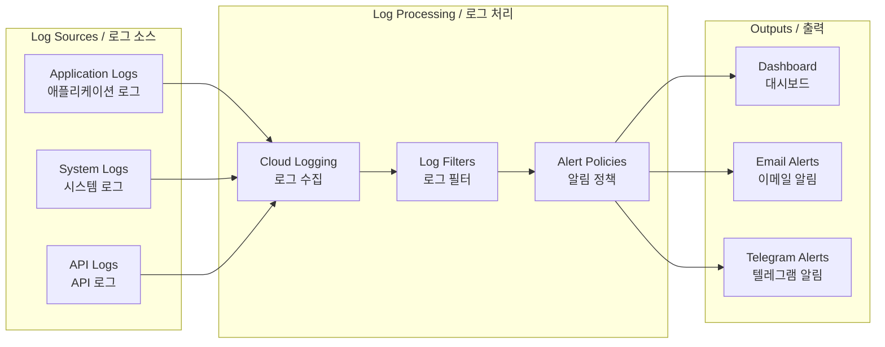

# Architecture Documentation / 아키텍처 문서

## 개요 / Overview

### 한국어
CryptoSignal은 암호화폐 시장에서 자동으로 매수 신호를 감지하고 텔레그램을 통해 실시간 알림을 제공하는 봇입니다. 주봉(1W) 캔들 데이터를 기반으로 Kwon Strategy를 사용하여 잠재적인 매수 기회를 식별합니다. 시스템은 실시간 시가총액 필터링을 통해 관련성 높은 암호화폐만을 모니터링하며, Google Cloud Run에서 24시간 운영되도록 설계되었습니다.

### English
CryptoSignal is an automated bot that detects buy signals in the cryptocurrency market and provides real-time notifications via Telegram. Using weekly (1W) candlestick data and the Kwon Strategy, it identifies potential buying opportunities. The system monitors only relevant cryptocurrencies through real-time market cap filtering and is designed to operate 24/7 on Google Cloud Run.

## 시스템 아키텍처 / System Architecture

### 한국어
시스템은 여러 외부 API와 통신하며, 데이터를 처리하고, 신호를 생성한 후 사용자에게 알림을 전송하는 파이프라인 구조로 설계되었습니다.

### English
The system is designed with a pipeline architecture that communicates with multiple external APIs, processes data, generates signals, and sends notifications to users.

## 핵심 컴포넌트 / Core Components

### 한국어
시스템은 다음과 같은 주요 모듈로 구성됩니다:

### English
The system consists of the following main modules:

### 모듈별 상세 설명 / Module Details

#### 1. crypto_signal_bot.py - 메인 컨트롤러 / Main Controller

**한국어**
- 전체 시스템의 진입점이자 조정자 역할
- 스케줄링을 통해 매시간 자동 스캔 실행
- API 오류 처리 및 재시도 로직 구현
- 텔레그램 봇 통합 및 메시지 전송

**English**
- Entry point and orchestrator for the entire system
- Executes automatic scans every hour through scheduling
- Implements API error handling and retry logic
- Telegram bot integration and message delivery

#### 2. symbols.py - 심볼 및 데이터 관리 / Symbol and Data Management

**한국어**
- CoinMarketCap API를 통한 시가총액 데이터 수집
- Binance API를 통한 유효 거래쌍 검증
- 캔들스틱 데이터 가져오기
- HTTP 요청 재시도 로직 구현

**English**
- Market cap data collection via CoinMarketCap API
- Valid trading pair verification via Binance API
- Candlestick data fetching
- HTTP request retry logic implementation

#### 3. decision.py - 전략 엔진 / Strategy Engine

**한국어**
- Kwon Strategy 구현
- 단일 최고점 패턴 인식
- 하락 패턴 분석
- EMA 기반 진입점 결정

**English**
- Kwon Strategy implementation
- Single peak pattern recognition
- Bearish pattern analysis
- EMA-based entry point determination

## 데이터 흐름 / Data Flow

### 한국어
시스템의 데이터 처리 과정은 다음과 같습니다:

### English
The system's data processing flow is as follows:

## 주요 설계 결정사항 / Key Design Decisions

### 1. 주봉 기반 분석 / Weekly Candle Analysis

**한국어**
- 노이즈 감소: 주봉은 일봉보다 시장 노이즈가 적어 더 명확한 신호 제공
- 신뢰성: 장기 트렌드를 반영하여 더 신뢰할 수 있는 신호 생성
- API 효율성: 요청 횟수가 적어 API 제한에 덜 민감

**English**
- Noise reduction: Weekly candles have less market noise than daily candles, providing clearer signals
- Reliability: Reflects long-term trends for more reliable signal generation
- API efficiency: Fewer requests make it less sensitive to API limits

### 2. 실시간 시가총액 필터링 / Real-time Market Cap Filtering

**한국어**
- 관련성: 적절한 시가총액 범위의 코인만 모니터링하여 효율성 증대
- 동적 업데이트: 매 스캔마다 최신 시가총액 데이터 사용
- 리스크 관리: 너무 작거나 큰 시가총액 코인 제외

**English**
- Relevance: Increased efficiency by monitoring only coins within appropriate market cap range
- Dynamic updates: Uses latest market cap data for each scan
- Risk management: Excludes coins with too small or too large market caps

### 3. 에러 처리 전략 / Error Handling Strategy

**한국어**
- Exponential Backoff: API 제한 시 지수적으로 증가하는 대기 시간
- API Ban 감지: 418/429 에러 시 1시간 대기
- Fallback 메커니즘: API 실패 시 대체 데이터 소스 사용

**English**
- Exponential Backoff: Exponentially increasing wait times for API limits
- API Ban detection: 1-hour wait on 418/429 errors
- Fallback mechanism: Alternative data sources on API failure

## API 설계 및 통합 / API Design and Integration

### 외부 API 통합 / External API Integration

#### 1. CoinMarketCap API

**한국어**
- 용도: 실시간 시가총액 데이터 수집
- 엔드포인트: `/v1/cryptocurrency/listings/latest`
- 페이지네이션: 최대 5000개씩, 여러 페이지 지원
- 인증: API 키 헤더 방식

**English**
- Purpose: Real-time market cap data collection
- Endpoint: `/v1/cryptocurrency/listings/latest`
- Pagination: Up to 5000 items per page, multi-page support
- Authentication: API key header method

#### 2. Binance API

**한국어**
- 용도: 가격 데이터 및 캔들스틱 정보
- 엔드포인트: `/api/v3/klines`, `/api/v3/exchangeInfo`
- 제한: 분당 1200 가중치
- 인증: 공개 엔드포인트 사용 (API 키 선택적)

**English**
- Purpose: Price data and candlestick information
- Endpoints: `/api/v3/klines`, `/api/v3/exchangeInfo`
- Limits: 1200 weight per minute
- Authentication: Public endpoints (API key optional)

#### 3. Telegram Bot API

**한국어**
- 용도: 사용자 알림 전송
- 기능: 텍스트 메시지, 마크다운 포맷 지원
- 인증: 봇 토큰 기반

**English**
- Purpose: User notification delivery
- Features: Text messages, markdown format support
- Authentication: Bot token based

## 배포 아키텍처 / Deployment Architecture

### Google Cloud Run 구성 / Google Cloud Run Configuration

### 컨테이너 구성 / Container Configuration

**한국어**
- 베이스 이미지: Python 3.11-slim
- 메모리: 512Mi (조정 가능)
- CPU: 1 vCPU
- 타임아웃: 3600초 (1시간)
- 최소 인스턴스: 1 (항상 실행)
- 보안: 비root 사용자로 실행

**English**
- Base image: Python 3.11-slim
- Memory: 512Mi (adjustable)
- CPU: 1 vCPU
- Timeout: 3600 seconds (1 hour)
- Minimum instances: 1 (always running)
- Security: Runs as non-root user

## 보안 고려사항 / Security Considerations

### 1. API 키 관리 / API Key Management

**한국어**
- Google Secret Manager 사용으로 키 노출 방지
- 환경 변수로 런타임에 주입
- 코드에 하드코딩된 키 없음
- 최소 권한 원칙 적용 (읽기 전용 API 사용)

**English**
- Prevents key exposure using Google Secret Manager
- Injected at runtime via environment variables
- No hardcoded keys in code
- Principle of least privilege (read-only APIs)

### 2. 네트워크 보안 / Network Security

**한국어**
- HTTPS를 통한 모든 API 통신
- Cloud Run의 자동 TLS 종료
- 인증되지 않은 접근 차단
- IP 화이트리스트 불필요 (Google Cloud IP 신뢰)

**English**
- All API communications via HTTPS
- Automatic TLS termination by Cloud Run
- Blocks unauthenticated access
- No IP whitelisting needed (Google Cloud IPs trusted)

### 3. 컨테이너 보안 / Container Security

**한국어**
- 최소 권한 사용자로 실행
- 읽기 전용 파일 시스템
- 정기적인 의존성 업데이트
- 취약점 스캔

**English**
- Runs with least privileged user
- Read-only file system
- Regular dependency updates
- Vulnerability scanning

## 확장성 고려사항 / Scalability Considerations

### 1. 수평적 확장 / Horizontal Scaling

**한국어**
- Cloud Run의 자동 스케일링 활용 가능
- 상태 비저장 설계로 인스턴스 추가 용이
- 로드 밸런싱 자동 처리

**English**
- Can leverage Cloud Run's auto-scaling
- Stateless design allows easy instance addition
- Automatic load balancing

### 2. API 제한 관리 / API Limit Management

**한국어**
- 요청 캐싱으로 API 호출 감소 가능
- 배치 처리로 효율성 증대
- 다중 API 키 로테이션 구현 가능

**English**
- Request caching can reduce API calls
- Batch processing for increased efficiency
- Multiple API key rotation possible

### 3. 데이터베이스 통합 / Database Integration

**한국어**
- 현재: 메모리 내 신호 추적
- 미래: Cloud SQL 또는 Firestore 통합 가능
- 신호 이력 저장 및 분석 기능 추가 가능

**English**
- Current: In-memory signal tracking
- Future: Cloud SQL or Firestore integration possible
- Signal history storage and analysis features can be added

## 모니터링 및 운영 / Monitoring and Operations

### 1. 로깅 전략 / Logging Strategy

### 2. 성능 메트릭 / Performance Metrics

**한국어**
- 스캔 완료 시간
- API 응답 시간
- 신호 감지율
- 오류율 및 재시도 횟수

**English**
- Scan completion time
- API response time
- Signal detection rate
- Error rate and retry count

### 3. 운영 체크리스트 / Operational Checklist

**한국어**
- 일일 상태 업데이트 확인
- 주간 로그 검토
- 월간 API 사용량 점검
- 분기별 의존성 업데이트

**English**
- Daily status update verification
- Weekly log review
- Monthly API usage check
- Quarterly dependency updates

## 향후 개선 방향 / Future Improvements

### 1. 기능 개선 / Feature Enhancements

**한국어**
- 다중 전략 지원
- 웹 대시보드 구현
- 백테스팅 통합
- 포트폴리오 추적

**English**
- Multiple strategy support
- Web dashboard implementation
- Backtesting integration
- Portfolio tracking

### 2. 기술적 개선 / Technical Improvements

**한국어**
- WebSocket 실시간 데이터 스트리밍
- 머신러닝 기반 신호 최적화
- 분산 처리 아키텍처
- 이벤트 기반 아키텍처 전환

**English**
- WebSocket real-time data streaming
- Machine learning-based signal optimization
- Distributed processing architecture
- Migration to event-driven architecture

### 3. 사용자 경험 개선 / User Experience Improvements

**한국어**
- 사용자별 설정 관리
- 다국어 지원
- 모바일 앱 개발
- 신호 성과 추적

**English**
- Per-user configuration management
- Multi-language support
- Mobile app development
- Signal performance tracking

## 결론 / Conclusion

### 한국어
CryptoSignal은 클라우드 네이티브 아키텍처를 채택하여 안정적이고 확장 가능한 암호화폐 신호 감지 시스템을 구현했습니다. 모듈화된 설계와 강력한 오류 처리 메커니즘을 통해 24시간 무중단 서비스를 제공하며, Google Cloud Run의 관리형 서비스를 활용하여 운영 부담을 최소화했습니다.

### English
CryptoSignal implements a stable and scalable cryptocurrency signal detection system by adopting a cloud-native architecture. Through modular design and robust error handling mechanisms, it provides 24/7 uninterrupted service while minimizing operational burden by leveraging Google Cloud Run's managed services.