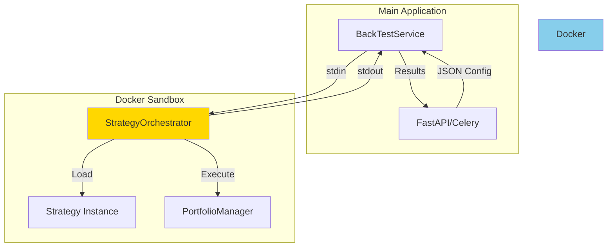
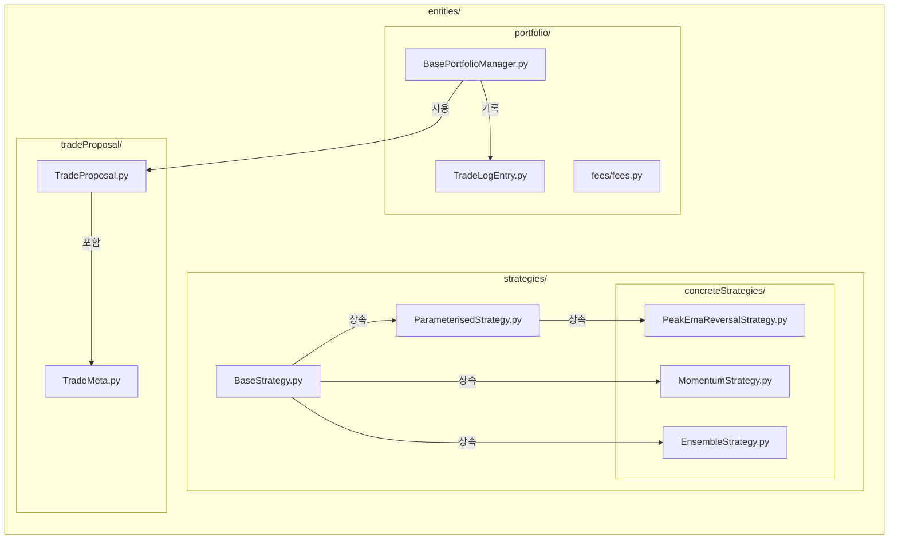
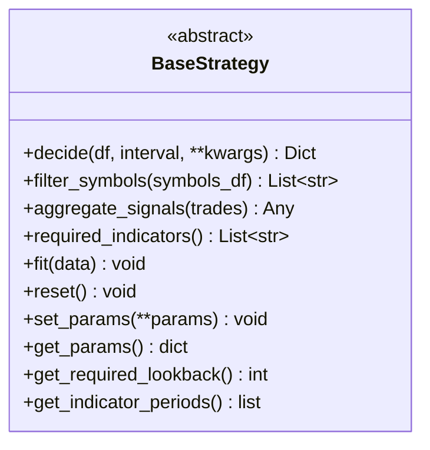
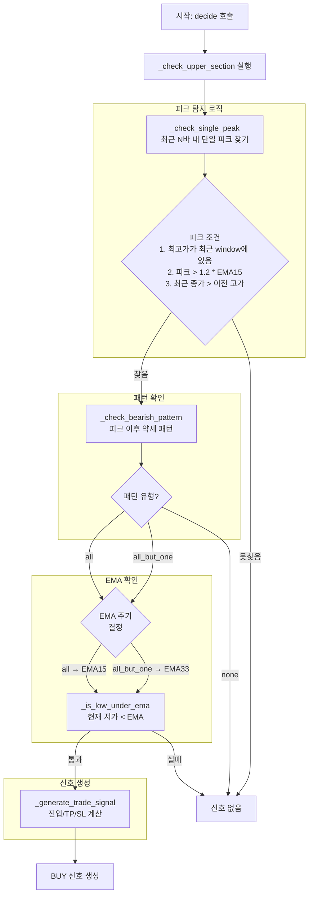
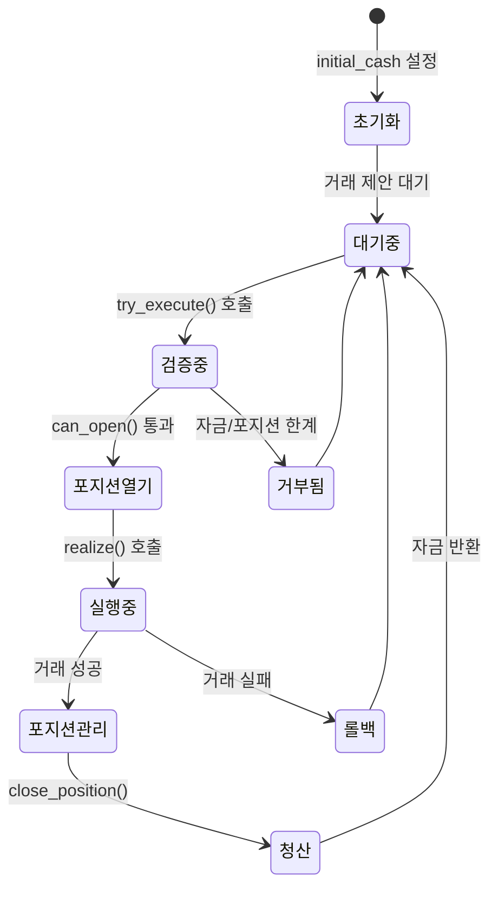
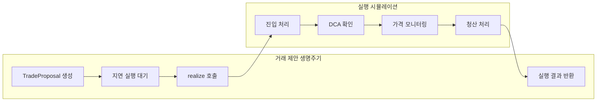
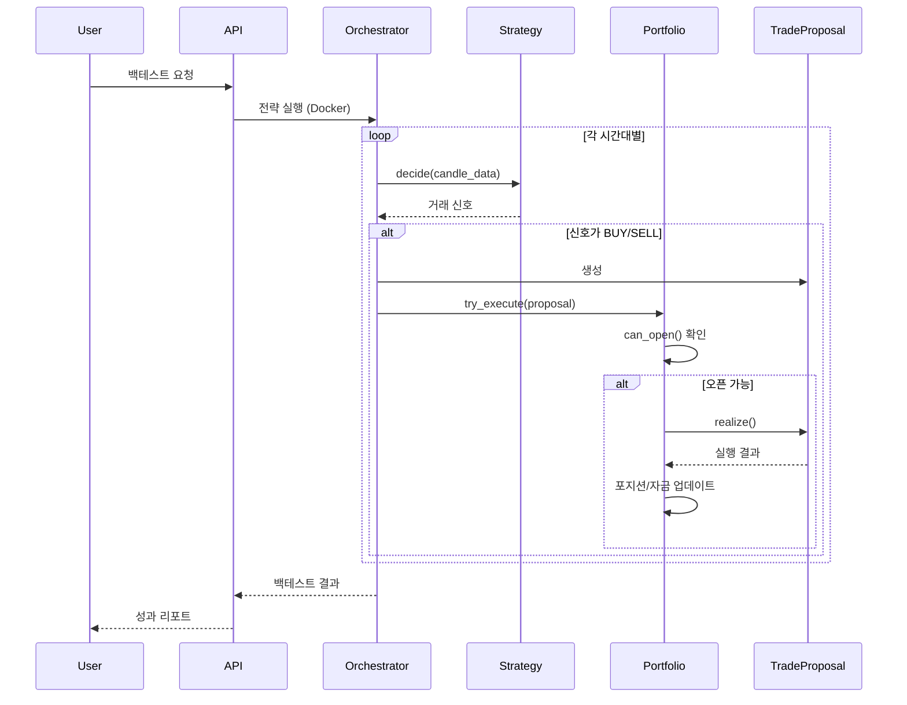

# 전략 오케스트레이션 및 Entities 폴더 상세 분석

이 문서는 Binance Trading Bot의 전략 오케스트레이션 시스템과 entities 폴더 내부의 모든 파일들의 역할과 주요 함수들을 상세히 설명합니다.

## 1. 전략 오케스트레이션 (Strategy Orchestration) 시스템

### 1.1 샌드박싱 아키텍처 개요



### 1.2 샌드박싱 실행 플로우

**BackTestService의 샌드박싱 호출 메커니즘:**

```python
def call_strategy_orchestrator(input_config: dict):
    """
    Docker 컨테이너를 통한 전략 실행 격리
    - 입력: JSON 설정 (symbols, strategy, parameters, data)
    - 출력: JSON 결과 (trades, performance, equity_curve)
    """
```

주요 특징:
- **완전 격리**: 각 백테스트는 독립된 Docker 컨테이너에서 실행
- **상태 비공유**: 컨테이너 간 상태 공유 없음
- **통신 프로토콜**: stdin/stdout을 통한 JSON 통신
- **자동 정리**: `--rm` 플래그로 실행 후 컨테이너 자동 삭제

## 2. Entities 폴더 구조 및 역할

### 2.1 전체 구조도



## 3. Strategies 디렉토리 상세 분석

### 3.1 BaseStrategy.py - 추상 기본 클래스



**핵심 메소드 설명:**

#### `decide(df: pd.DataFrame, interval: str, **kwargs) -> Dict[str, Any]`
- **역할**: 전략의 핵심 결정 로직
- **입력**: 
  - `df`: OHLCV 캔들 데이터
  - `interval`: 시간 간격 ('1w', '1d' 등)
- **출력**: 거래 신호 딕셔너리
  ```python
  {
      "signal": "BUY" | "SELL" | "NO" | "CLOSE",
      "entry_price": float,
      "tp_price": float,      # Take Profit
      "sl_price": float,      # Stop Loss
      "confidence": float,    # 신뢰도 (선택사항)
      "meta": dict,          # 추가 메타데이터
      "strategy_name": str,
      "direction": "LONG" | "SHORT"
  }
  ```

#### `get_required_lookback() -> int`
- **역할**: 전략이 필요한 과거 데이터 바 개수
- **기본값**: 35개 또는 지표 주기 중 최대값
- **용도**: 백테스트 시 충분한 데이터 확보

#### `filter_symbols(symbols_df: pd.DataFrame) -> List[str]`
- **역할**: 거래할 심볼 필터링
- **기본동작**: 모든 심볼 반환
- **커스터마이징**: 특정 조건으로 심볼 선택 가능

### 3.2 PeakEmaReversalStrategy.py - 피크 EMA 반전 전략



**주요 메소드 상세:**

#### `_check_single_peak(highs, closes, recent_window=7, total_window=200) -> int`
```python
# 피크 탐지 조건:
1. total_window 내 최고가가 recent_window 안에 있음
2. 피크 고가 > 1.2 * EMA15
3. 최근 종가 중 하나가 이전 고가보다 높음
4. 피크의 종가 또는 이전 종가가 모든 이전 고가보다 높음
```

#### `_check_bearish_pattern(df, window=7, start_idx, buffer=0.1) -> str`
```python
# 약세 패턴 판단:
- "all": 모든 캔들이 약세
- "all_but_one": 하나만 제외하고 약세
- "none": 약세 패턴 아님

# 약세 캔들 조건:
1. 현재 고가 <= 이전 고가
2. 종가 <= 시가 (음봉)
3. 고가 <= 시가 * (1 + buffer)
```

#### `_generate_trade_signal(df, initial_signal, tp_ratio=0.1, sl_ratio=0.05)`
```python
# 거래 신호 생성:
- entry_price = 현재 EMA 값
- tp_price = entry_price * (1 + tp_ratio)  # 기본 10% 상승
- sl_price = entry_price * (1 - sl_ratio)  # 기본 5% 하락
- direction = "LONG" (항상 매수만)
```

### 3.3 EnsembleStrategy.py - 앙상블 전략

```python
class EnsembleStrategy(BaseStrategy):
    def __init__(self, strategies: List[BaseStrategy], weights: List[float] = None):
        self.strategies = strategies
        self.weights = weights or [1.0] * len(strategies)
```

**특징:**
- 여러 전략을 조합하여 사용
- 가중치 기반 의사결정 (현재는 첫 BUY 신호 반환)
- 확장 가능한 구조

## 4. Portfolio 디렉토리 상세 분석

### 4.1 BasePortfolioManager.py - 포트폴리오 관리자



**주요 속성:**
- `cash`: 현재 보유 현금
- `max_positions`: 최대 동시 포지션 수 (기본: 5)
- `positions`: {symbol: [포지션 리스트]} 구조
- `trade_log`: 완료된 거래 기록
- `equity_curve`: 시간별 자산 가치

**핵심 메소드 설명:**

#### `can_open(symbol, entry_price, size) -> bool`
```python
# 포지션 오픈 가능 여부 확인
조건1: 현재 총 포지션 수 < max_positions
조건2: cash >= entry_price * size
```

#### `try_execute(trade_proposal: TradeProposal, add_buy_pct=5.0) -> bool`
```python
# 거래 실행 프로세스:
1. 진입 가능 여부 확인 (can_open)
2. 자금 예약 및 포지션 추가
3. TradeProposal.realize() 호출하여 거래 시뮬레이션
4. 성공 시 결과 처리, 실패 시 롤백
```

#### `close_position(...)`
```python
# 포지션 청산 및 기록:
1. 활성 포지션에서 제거
2. 자금 반환 (exit_price * size)
3. TradeLogEntry 생성 및 기록
4. mark_to_market 호출하여 자산가치 업데이트
5. 선택적 분석 콜백 실행
```

#### `mark_to_market(current_prices, time) -> float`
```python
# 포트폴리오 총 가치 계산:
equity = cash + Σ(각 포지션의 현재 시장가치)
```

### 4.2 TradeLogEntry.py - 거래 기록

```python
@dataclass
class TradeLogEntry:
    symbol: str
    entry_time: int
    entry_price: float
    exit_time: int
    exit_price: float
    size: float
    exit_type: str  # 'TP', 'SL', 'CLOSE'
    result: str     # 'WIN', 'LOSS'
    return_pct: float
    pnl: float
    direction: str  # 'LONG', 'SHORT'
```

**팩토리 메소드:**
```python
@classmethod
def from_args(cls, symbol, entry_time, entry_price, 
              exit_time, exit_price, size, trade):
    # trade 딕셔너리에서 TradeLogEntry 생성
    # LONG/SHORT에 따른 PnL 계산 자동화
```

## 5. TradeProposal 디렉토리 상세 분석

### 5.1 TradeMeta.py - 거래 메타데이터

```python
@dataclass(frozen=True)  # 불변 객체
class TradeMeta:
    symbol: str          # 거래 심볼
    entry_time: int      # 진입 시간
    entry_price: float   # 진입 가격
    tp_price: float      # 목표가
    sl_price: float      # 손절가
    size: float = 1      # 포지션 크기
    direction: str = "LONG"  # 거래 방향
```

### 5.2 TradeProposal.py - 거래 제안 및 시뮬레이션



**핵심 메소드: `realize()`**

```python
def realize(self, add_buy_pct=5.0, fee=0.0, slippage=0.0, 
            execution_delay_bars=0, crossing_policy="prefer_sl", 
            analytics_hook=None) -> Optional[List[Dict[str, Any]]]
```

**실행 플로우:**

1. **진입 처리**:
   ```python
   # 실행 지연 적용
   entry_idx = 0 + execution_delay_bars
   
   # 실제 진입가 계산 (슬리피지 + 수수료)
   real_entry_price = min(open, entry_price) * (1 + slippage) * (1 + fee)
   
   # DCA 가격 설정
   # LONG: 5% 하락 시 추가 매수
   # SHORT: 5% 상승 시 추가 매도
   ```

2. **DCA (Dollar Cost Averaging)**:
   ```python
   if not additional_dca_done:
       # LONG: low <= add_dca_price
       # SHORT: high >= add_dca_price
       if dca_trigger:
           trades.append(새로운 거래)
   ```

3. **청산 로직**:
   ```python
   # 동시 TP/SL 도달 처리
   if both_hit:
       if crossing_policy == "prefer_sl": 선택 = SL
       elif crossing_policy == "prefer_tp": 선택 = TP
       elif crossing_policy == "random": 선택 = 랜덤
   
   # 개별 TP/SL 확인
   # LONG: low <= sl_price 또는 high >= tp_price
   # SHORT: high >= sl_price 또는 low <= tp_price
   ```

4. **결과 계산**:
   ```python
   # 수익률 계산 (LONG/SHORT 구분)
   return_pct = _calc_return_pct(entry, exit, is_short)
   
   # 승/패 판정
   result = _result_judge(entry, exit, is_short)
   ```

## 6. 시스템 통합 플로우



## 7. 주요 설계 패턴 및 특징

### 7.1 적용된 디자인 패턴

1. **Strategy Pattern**: BaseStrategy로 전략 인터페이스 통일
2. **Template Method**: BaseStrategy의 훅 메소드들
3. **Composite Pattern**: EnsembleStrategy의 전략 조합
4. **Lazy Evaluation**: TradeProposal의 지연 실행
5. **Immutable Object**: TradeMeta의 불변성
6. **Factory Method**: TradeLogEntry.from_args()
7. **Dependency Injection**: 수수료/슬리피지 모델 주입

### 7.2 시스템 특징

1. **완전 격리**: Docker 기반 샌드박싱
2. **확장성**: 새 전략 추가 용이
3. **현실성**: 슬리피지, 수수료, 실행 지연 모델링
4. **유연성**: LONG/SHORT 모두 지원
5. **추적성**: 모든 거래 상세 기록
6. **안정성**: 롤백 메커니즘 내장

이 아키텍처는 실제 거래 환경을 정확히 시뮬레이션하면서도 안전하고 확장 가능한 백테스팅 환경을 제공합니다.
